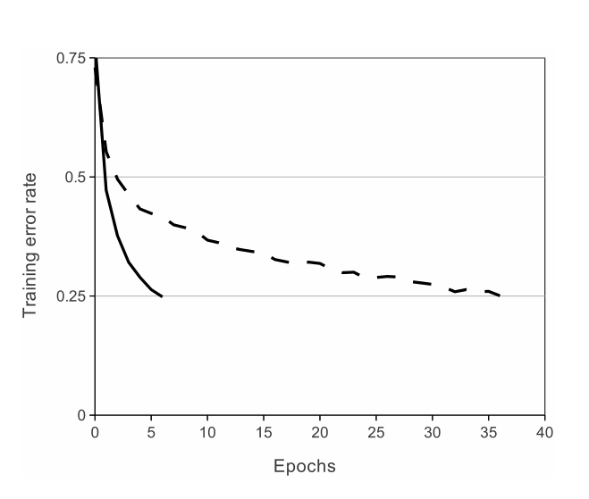

# AlexNet网络学习及仿真

[TOC]

## 前言

AlexNet的论文[[1]](#refer-1)可以参考这个链接：[《ImageNet Classification with Deep Convolutional Neural Networks》](https://proceedings.neurips.cc/paper/2012/file/c399862d3b9d6b76c8436e924a68c45b-Paper.pdf)

自从 2012 年 ImageNet 挑战大赛上，AlexNet 取得15.3%的 error rate，而第二名的 error rate 却是26.2%，这个巨大的差距让人们把目标投入到深度学习，从此开启了深度学习的浪潮。

之前学习深度学习就了解过了 AlexNet 这个神经网络了，但是还没有深入了解过，撑着最近空闲，尝试阅读一下 AlexNet 的论文并尝试复现一下相关的代码，实践出真知，直接开撸。

## AlexNet相关知识

### 1 前言（Introduction）

当前使用机器学习的方法进行目标识别主要是为了提升性能。为了提高性能，尝试搜集更多的数据集和模型，并使用更好技巧防止过拟合。当前 MNIST 数字识别任务的最大错误率（<0.3%）接近人类的表现，但是现实环境中的物体表现出相当大的不确定性，说出为了识别他们，有必要使用更大的数据集。一些大数据集，例如 LabelMe，它由数十万张完全分割的图像，和 ImageNet，他包含超过22, 000个分类的总共 1500 万张高像素标记图像。

要从数百万张图像中了解成千上万个对象，我们需要一个举要大学习能力的模型。然而，对象识别任务的巨大复杂性意味着即使是像 ImageNet 这样大的数据集也不能指定这个问题，因此我们的模型也应该有大量先验知识来补偿我们没有的所有数据。卷积神经网络构成了这样一类模型。可以通过改变它们的深度和宽度控制它们的容量，并且它们还对图像的性质做出了强有力的和最正确的假设(即统计的平稳性和像素依赖性的局部性)。因此，与具有类似大小的层的标准前馈神经网络相比，卷积神经网络（CNN）具有少得多的连接和参数，因此它们更容易训练，而它们理论上最好的性能可能只是稍微差一点。

尽管卷积神经网络（CNN）具有吸引人的特点，尽管其本地架构相对高效，但大规模应用于高分辨率图像仍然非常昂贵。幸运的是，当前的图形处理器，加上高度优化的2D卷积实现，足够强大，可以促进有趣的大卷积神经系统的训练，最近的数据集，如 ImageNet，包含足够多的标记示例，可以在没有严重过拟合的情况下训练这种模型。

论文主要的工作是：

* 在ILSVRC-2010和ILSVRC-2012竞赛使用的 ImageNet 数据集的子集上训练了一个2012年以来最大的卷积神经网络，并且达到了最好的效果
* 编写了一个高度优化的 2D 卷积的 GPU 实现
* 使用新的方法防止过拟合

### 2 数据集（The Dataset）

ImageNet是一个由超过1500万个标记的高分辨率图像组成的数据集，属于大约22，000个类别。这些图片是从网络上收集的，并由人类贴标机使用亚马逊的机械土耳其人众包工具进行标记。从2010年开始，作为帕斯卡视觉对象挑战赛的一部分，每年都会举办一场名为 ImageNet 大规模视觉识别挑战赛(ILSVRC)的比赛。ILSVRC使用ImageNet的一个子集，在1000个类别中各有大约1000个图像。总共大约有120万张训练图像、5万张验证图像和15万张测试图像。

ILSVRC-2010是ILSVRC唯一一个测试集标签可用的版本，所以这是我们执行大部分实验的版本。由于我们也在ILSVRC-2012竞赛中输入了我们的模型，在第6节中，我们也报告了我们在该版本数据集上的结果，对于该版本数据集，测试集标签不可用。在ImageNet上，通常会报告两个错误率:top-1和top-5，其中top-5错误率是测试图像中正确标签不在模型认为最有可能的五个标签中的部分。

ImageNet由不同分辨率的图像组成，而我们的系统需要恒定的输入维度。因此，我们将图像下采样到256 × 256的固定分辨率。给定一个矩形图像，我们首先重新缩放图像，使较短的边长为256，然后从结果图像中裁剪出中心的256×256块。我们没有以任何其他方式预处理图像，除了从每个像素中减去训练集的平均活动。所以我们在像素的原始RGB值上训练我们的网络。

### 3 网络架构（The Architecture）

AlexNet 网络包含八个层-五个卷积层和三个全连接层。

#### 3.1 ReLU非线性（ReLU Nonlinearity）

将神经网络的输出 $f$ 建模输出为 $x$ 的函数的标准方法是:
$$
f(x) = \tanh(x) \quad or \quad f(x) = (1+e^{-x})^{-1}
$$
就梯度下降的训练时间而言，这些饱和非线性比非饱和非线性慢的多。对于这种非线性的神经元成为非线性整流单元（Rectified Linear Units, ReLU），可以表示为如下式所示：
$$
f(x) = \max{(0, x)}
$$
带有ReLUs的深度卷积神经网络比带有tanh单元的同类网络训练速度快几倍。下图展示了特定的四层卷积网络，在CIFAR-10数据集上达到25%训练误差所需的迭代次数。

如果使用传统的饱和神经元模型，那么要训练这个大的神经网络将会是非常困难的。

#### 3.2 在多个GPU上训练（Training on Multiple GPUs）

由于网络的参数和架构太大，当时的 GTX580 显卡仅有 3GB 的显存，无法将神经网络放在一张显卡上。所以采用了并行化方法，将网络分布在两个显卡上。

当前的图形处理器特别适合跨图形处理器并行化，因为它们能够直接读写彼此的内存，而无需通过主机内存。我们采用的并行化方案本质上是将一半的内核(或神经元)放在每个图形处理器上，还有一个额外的技巧:图形处理器只在特定的层中通信。这意味着，例如，第3层的内核从第2层的所有内核映射中获取输入。然而，第4层中的内核仅从第3层中驻留在同一图形处理器上的内核映射中获取输入。选择连接模式是交叉验证的一个问题，但这允许我们精确地调整通信量，直到它成为计算量中可接受的一部分。

#### 3.3 局部响应归一化（Local Response Normalization）

生物学上有一个概念叫侧抑制（lateral inhibitio），指的是被激活神经元抑制相邻神经元[[2]](#refer-2)。归一化（normalization）的目的就是“抑制”，局部响应归一化就是借鉴侧抑制的思想来实现局部抑制。具体的计算公式如下所示：
$$
b_{x, y}^i = a_{x,y}^i \Bigg(k+\alpha \sum_{j=\max(0, i-n/2)}^{\min(N-1, i+n/2)}(a_{x,y}^j)^2 \Bigg)^{\beta}
$$
其中 $\alpha_{x,y}^i$ 表示的是第 $i$ 个核在位置 $(x,y)$ 运用激活函数 ReLU 后的输出，$n$ 是同一位置临近的kernel map的数目，N是kernel的总数，参数 $K, n, \alpha, \beta$ 都是超参数，其值由验证集确定，一般设置为 
$$
k=2, n=5, \alpha=10^{-4}, \beta=0.75
$$
但是具有争议的一点是，Simonyan等人[[3]](#refer-3)提到LRN没有提高网络的性能，反而增加了内存需求和运行时间。

#### 3.4 重叠池（Overlapping Pooling）

卷积网络中的池化层汇集了同一核心特征图邻近神经元的输出。传统的池化层的邻域不重叠，也可以说是传统的池化层是由间隔 $s$ 个像素点的池化单元网格组成的，每个网格汇总了以汇集单元位置为中心的大小为 $z \times z$ 的邻域，设置 $s=z$ ，就是传统的池化层。如果设置 $s<z$ ，就得到了重复的池化层（overlapping pooling）。在AlexNet中，池化层设置的是 $s=2, z=3$，比起 $s=2, z=2$ ，重叠池化层的 top-1 和 top-5 的错误率（error rates）减少了 0.4% 和 0.3%。在训练过程中还注意到有重叠池化的模型不太容易过拟合。

#### 3.5 总体架构（Overall Architecture）

如下图所示，总体的架构是包含八个层：前五个是卷积层（convolutional layer），其余三个是全连接层（fully-connected layer）。最后一个全连接层的输出经过一个1000路的 softmax 函数，产生1000个分类。

各个层之间的关系大致的描述：

* 2，4,  5卷积层的内核只与前一层同一GPU上的内核连接，第3层是连接到第二层的所有核心图（kernel map）
* 全连接层的神经元和前一层的所有神经元相连
* 响应归一化层（Response-normalization layer）在第 1, 2 卷积层之后
* 3.4节描述的最大池化重叠层在响应标准化层以及第5个卷积层之后
* ReLU非线性层在每一个卷积层和全连接层的输出之后

**卷积层的参数描述**

* conv1
  * input: 224 x 224 x 3
  * kernels
    * nums: 96
    * size: 11 x 11 x 3
    * stride: 4
* conv2
  * input: 第一卷积层的输出（响应归一化和池化层后的输出）
  * kernels
    * nums: 256
    * size: 5 x 5 x 48
* conv3
  * input: 第二卷积层的输出（响应归一化层和池化层后的输出）
  * kernels
    * nums: 384
    * size: 3 x 3 x 256
* conv4
  * input: 第三卷积层的输出
  * kernels
    * nums: 384
    * size: 3 x 3 x 192
* conv5
  * input: 第四卷积层的输出
  * kernels
    * nums: 256
    * size: 3 x 3 x 192

每个全连接层有 4096 个神经元

### 4 减少过拟合（Reducing Overfitting）

AlexNet网络架构有6000万个参数。尽管ILSVRC的1000个类使每个训练示例对从图像到标签的映射施加10位约束，但这不足以在没有相当大的过拟合的情况下学习如此多的参数。下面，我们描述两种对抗过度拟合的主要方法。

#### 4.1 数据增强（Data Augmentation）

减少图像过拟合的最常用的方法就是增加数据集，而增加图像数据集最简单和最常用的方法就是在不改变图像核心元素（即不改变标签的情况下）对图像进行一定的变换，例如垂直或者水平方向的翻转和镜像等。AlexNet采用了两种图像增强的方法，两种方法都允许使用很少的计算就可以从原图像中得到变换的图像，所以变换的图像不用存储在磁盘上。在一批图像在训练的时候，就通过代码生成它们的变换图像，这种数据增强的方案实际上是计算自由的（computationally free）。

第一种数据增强的方法是在原图像 $256 \times 256$ 大小的图片上提取 $224 \times 224$ 大小的块（patch）及其水平映射，这样从上到下，从左到右总共可以提取2048个块（$2 \times (256-224)^2 = 2 \times 32^2 = 2048$），也就意味着通过这种方法使得数据集增加了2048倍。提取块的大小是 $224 \times 224$ ，这和网络第一卷积层的输入一致。在测试中，网络通过提取 5 个 $224 \times 224$ 的块（四个角和中心）以及它们的水平映射，所以总共有 10 个块，这 10 个块预测的结果进行平均，得到的就是最后的预测值。

第二种数据增强的方法是改变训练图像中的RGB通道的强度。具体来说，我们在整个ImageNet训练集中对RGB像素值集执行PCA。对于每个训练图像，我们添加多个找到的主成分，其幅度与相应的特征值成比例乘以随机变量，该随机变量取自均值为零、标准差为0.1的高斯分布。因此，向每个RGB图像像素 $I_{xy}=[I_{xy}^R, I_{xy}^G, I_{xy}^B]^T$ 添加以下量:
$$
[p1, p2, p3][\alpha_1 \lambda_1, \alpha_2 \lambda_2, \alpha_3 \lambda_3]^T
$$
其中 $p_i$ 和 $\lambda$ 分别是RGB像素值的3 × 3协方差矩阵的特征向量和特征值，$\alpha$ 是前述的随机变量。对于特定训练图像的所有像素，每个 $\alpha$ 只绘制一次，直到该图像再次用于训练，此时它被重新绘制。该方案近似地捕捉了自然图像的一个重要特性，即目标对象对于照明强度和颜色的变化是不变的。该方案将top-1错误率降低了1%以上。

#### 4.2 丢弃（Dropout）

结合多个模型的预测值是减少错误的有效方法，但是对于训练时间需要花费好几天的大型网络来说太耗费时间了。Dropout 是一个非常有效的模型集成学习方法。Dropout方法将每个隐藏神经元以0.5的概率设置输出为0，被设置“drop out”的神经元对前向传播没有贡献，也不参与反向传播。因此，每次输入出现时，神经网络都会对不同的架构进行采样，但是这些所有架构都共享权重。这项技术减少了神经元复杂的共同适应。测试时，使用所用的神经元，把它们的输出乘以0.5，这是一个合理的近似，可以得到指数多个dropout网络预测分布的几何平均值。网络中3个全连接层的前两个全连接层中使用了dropout，如果没有dropout，网络将会表现大量的过拟合，dropout也使得收敛所需要的次数增加了一倍。

### 5 学习的细节（Details of learning）

* 训练的方法是随机梯度下降（stochastic gradient descent）
* 批大小（batch size）: 128
* 动量（momentum）: 0.9
* 权重衰减（weight decay）:0.0005

少量的权重衰减对模型的学习很重要，权重衰减不仅仅是一个正则化，它减少了模型的训练误差，权重 $w$ 的更新规则为：
$$
v_{i+1} := 0.9 \cdot v_i - 0.0005 \cdot \epsilon \cdot w_i - \epsilon \cdot \Big < \frac{\partial L}{\partial w}|_{w_i} \Big>_{D_i} \\
w_{i+1} := w_i + v_{i+1}
$$
其中 $i$ 是迭代索引（iteration index），$v$ 是动量变量，$\epsilon$ 是学习率，$\big <\frac{\partial L}{\partial w}|_{w_i} \big>_{D_i}$ 是第 $i$ 个块 $D_i$ 对 $w$  求导的平均值。

从标准偏差为0.01的零均值高斯分布中初始化每一层的权重。用常数1初始化了第二、第四和第五卷积层以及全连接隐藏层中的神经元偏置。这种初始化通过向ReLUs提供积极的输入来加速学习的早期阶段。用常数0初始化剩余层中的神经元偏置。对所有层使用相同的学习速率，在整个训练过程中手动调整。遵循的启发式方法是，当验证错误率停止随着当前学习率的提高而提高时，将学习率除以10。学习速率被初始化为0.01，在终止前减少了三倍。论文的作者对120万张图片进行了大约 90 个周期的训练，在两张 NVIDIA GTX 580 上训练了5到6天。

### 6 结果（Results）

在AlexNet出现之前的ILSVRC-2010比赛的冠军使用的方法是 Sparse coding，之后是SIFT+FVs，AlexNet出现后，CNN的方法远超过传统的方法，三者的top-1和top-5错误率的对比可以查看下表

|     Model     | Top-1 | Top-5 |
| :-----------: | :---: | :---: |
| Sparse coding | 47.1% | 28.2% |
|   SIFT+FVs    | 45.7% | 25.7% |
|      CNN      | 37.5% | 17.0% |

ILSVRC-2012竞赛，AlexNet获得冠军，远远超过第二名SIFT+FVs，结果如下表所示

|   Model   | Top-1(val) | Top-5(val) | Top-5(test) |
| :-------: | :--------: | :--------: | :---------: |
| SIFT+FVs  |    ——–     |    ——–     |    26.2%    |
|   1 CNN   |   40.7%    |   18.2%    |     ——–     |
|  5 CNNs   |   38.1%    |   16.4%    |  **16.4%**  |
| 1 CNN$*$  |   39.0%    |   16.6%    |     ——–     |
| 7 CNNs$*$ |   36.7%    |   15.4%    |  **15.3%**  |

* 文章描述的CNN模型top-5错误率达到了18.2%
* 对五个相似的CNN网络的输出平均得到的错误率是16.4%
* 训练一个CNN，在最后一个池层上增加第六个卷积层，对整个ImageNet  2011秋季版(15M图像，22K类别)进行分类，然后在ILSVRC-2012上对其进行“微调”，错误率为16.6%
* 用预训练的两个CNN网络和五个未预训练的CNN的输出求平均，得到的错误率为15.3%

其中带 $*$ 的表示网络经过ImageNet 2011秋季版本的图像的预训练。

#### 6.1 定性评估（Qualitative Evaluations）

上图展示了网络的两个数据连接层学到的各种频率和方法选择性的卷积核，以及彩色斑点。请注意两个图形处理器表现出的专门化，这是第3.5节中描述的受限连接的结果。GPU 1上的内核在很大程度上与颜色无关，而GPU 2上的内核在很大程度上是特定于颜色的。这种专门化发生在每次运行期间，并且独立于任何特定的随机权重初始化。

在图4的左面板中，我们通过计算八张测试图像上的前5名预测，定性地评估了网络所学到的东西。请注意，即使是偏离中心的物体，如左上角的螨虫，也可以被网识别。大部分前5名的标签看起来都很合理。例如，只有其他类型的猫被认为是豹子（leopard）的合理标签。在某些情况下(格栅-grille、樱桃-cherry)，照片的预期焦点确实模糊不清。

网络中最后的4096维的隐藏层产生的特征激活值（feature activations）也是另一个重要的指标。如果两张图像产生的特征激活向量的欧式距离（Euclidean）相近，那么我们可以说神经网络的更高层面上认为他们是相似的。在图4中展示了五张测试集的图像，每张测试集对应的最相似的六张训练集的图像，每一组按行排列。可以看到，在像素级上，检索到的训练图像在L2范数（欧几里得范数，欧式距离）并不相同。例如，检索到的狗和大象以各种姿态出现。

### 7 讨论（Discussion）

* 深度很重要，去掉任何中间层，都会导致性能的top-1下降约2%
* 为了简化时间，没有使用任何无监督的预训练。但是如果有足够的计算能力来显著增加网络大小的时候，而没有获得标记数据的时候，非监督预训练可能会有用
* 增大网络结果和加长训练时间可以改善网络的想能，但是要匹配人类视觉时空推理能力（infero-temporal）还相距甚远。如果希望在视频序列上使用非常大和深度的卷积网络，视频相对于静态的图像还有许多有用的时间结构信息。

## AlexNet仿真实现

## 参考文献

- [1] [Krizhevsky A , Sutskever I , Hinton G . ImageNet Classification with Deep Convolutional Neural Networks[J]. Advances in neural information processing systems, 2012, 25(2).](https://proceedings.neurips.cc/paper/2012/file/c399862d3b9d6b76c8436e924a68c45b-Paper.pdf)

- [2] [【深度学习技术】LRN 局部响应归一化](https://blog.csdn.net/hduxiejun/article/details/70570086)

- [3] [Simonyan K ,  Zisserman A . Very Deep Convolutional Networks for Large-Scale Image Recognition[J]. Computer Science, 2014.](https://arxiv.org/pdf/1409.1556.pdf)

