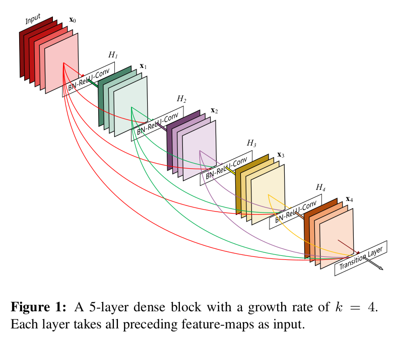
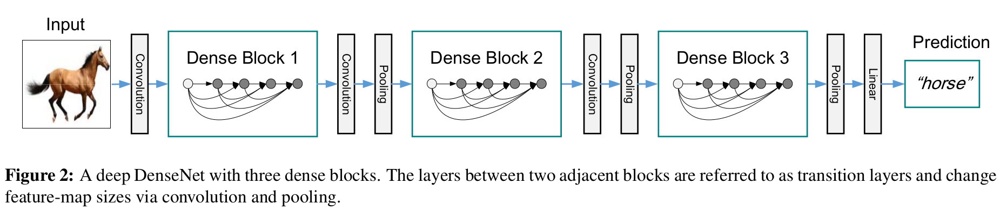

# DenseNet学习笔记

## 前言

之前的一些研究表明了在输入层和输出层之间添加一些跳接可以让网络架构更深，且训练更有效率。例如`ResNet`[[1]](#ref-1)，解决了深层网络梯度消失的问题，而`GoogleNet`[[2]](#ref-2)则是让网络加宽。借鉴这两种思想，让网络中各层之间的信息传递，将**所有的层连接起来**，这就是`DenseNet`[[3]](#ref-3)的基本思想。

在传统的卷积神经网络中，第$L$ 层就有 $L$ 个连接，每一层和其他的层相互连接，所以总共的跳接就有 $\frac{L(L+1)}{2}$，如[Figure 1](fig-1)所示。对于每一层来说，所有此前的网络层的特征图作为输入，而其自身的特征图作为之后所有层的输入。`DenseNet`有以下几个优点：

* 减轻了梯度消失问题（vanishing-gradient）
* 加强了特征传播（feature propagation）
* 更有效地利用特征
* 大大减少了参数数量

## DenseNet 架构

假设 $X_0$ 是是输入卷积网络的单张图片，网络包括 $L$ 层，每一层都实现了非线性变换 $H_l(\cdot)$，其中 $l$ 表示的是第 $l$ 层。$H_l(\cdot)$ 是包含了批量归一化（Batch Normalization, BN）、ReLU、池化和卷积的组合操作，将 $l^{th}$ 层的输出命名为 $X_l$。

### ResNets

传统的卷积前馈网络将 $l^{th}$ 的输出作为 $(l+1)^{th}$ 层的输入，得到这个转换公式：$X_l = H_l(X_{l-1})$。而`ResNet`通过标识函数（identity function）添加了一个绕过非线性变换 $H_l(\cdot)$ 的跳接

$$
X_l = H_l(x_{l-1}) + x_{l-1}
$$
`ResNet`的一个优点是梯度可以直接通过标识函数（identify function）从后面的层流向前面的层。但是，标识函数（identify function）和 $H_l$ 层的输出通过求和进行组合，这可能会阻碍网络中信息的流动。

### Dense 连接

为了进一步地层与层之间的信息流，`DenseNet`提出了一个不同的连接模型：对于每一层，都添加一个跳接到其他所有之后的层。[Figure 1](#fig-1)表示了`DenseNet`连接的方式。因此，$l^{th}$ 层网络接受了所有之前层的特征图 $X_0, \dots, X_{l-1}$ 作为输入：

$$
X_l = H_l([X_0, X_1, \dots, X_{l-1}])
$$
其中 $[X_0, X_1, \dots, X_{l-1}]$ 表示的是 $0, ..., l-1$ 层得到的特征图拼接的结果。

### Composite function

$H_l(\cdot)$ 表示的是三个连续的操作：

* batch normalization (BN)
* rectified linear unit (ReLU)
* 3 x 3 Conv

### 池化层

当特征图尺寸变化时，[式2](#eqa-2)中的拼接操作不可行。但是，卷积网络一个重要的部分就是降采样层，用于改变特征图的尺寸。为了在`DenseNet`架构中实现降采样，将网络分为多个紧密连接的`dense blocks`，如[Figure 2](#fig-2)所示。

将`dense block`之间的层叫做过渡层，在这里做卷积和池化操作。过渡层包含批量归一层和 1 x 1 卷积层，紧跟一个 2 x 2 平均池化层

### Growth rate

如果每个函数 $H_l$ 产生 $k$ 个特征图，之后的 $l^{th}$ 层有 $k_0 + k \times (l-1)$ 个输入特征图，其中 $k_0$ 表示输入层的通道数。`DenseNet` 和现有的网络架构最重要的区别是`DenseNet`层数很窄，仅有 $k=12$。将 $k$ 定义为网络的增长率

## 参考

1. [He K ,  Zhang X ,  Ren S , et al. Deep Residual Learning for Image Recognition[J]. 2016 IEEE Conference on Computer Vision and Pattern Recognition (CVPR), 2016.](https://arxiv.org/pdf/1512.03385.pdf)

2. [Szegedy C ,  Liu W ,  Jia Y , et al. Going Deeper with Convolutions[J]. IEEE Computer Society, 2014.](https://arxiv.org/pdf/1409.4842.pdf)

3. [Huang G ,  Liu Z ,  Laurens V , et al. Densely Connected Convolutional Networks[J]. IEEE Computer Society, 2016.](https://arxiv.org/pdf/1608.06993.pdf)

