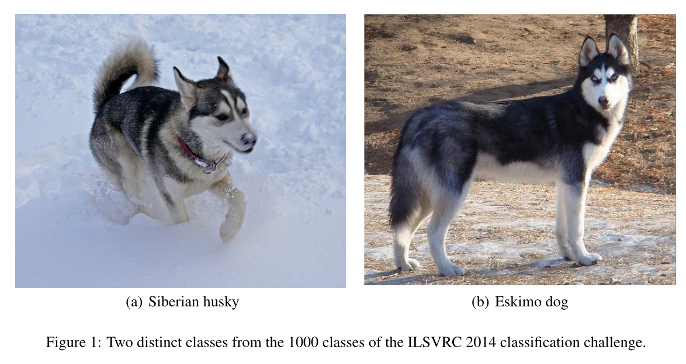
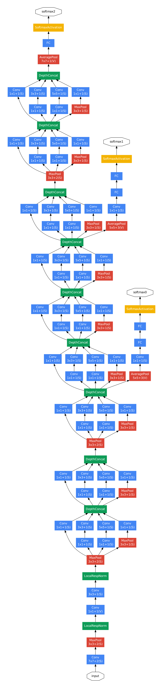

# GoogleNet学习笔记及实现

## 前言

2014年获得ImageNet挑战赛分类任务第一名的是GoogleNet，同年Vgg获得了定位任务第一名和分类任务第二名的成绩。GoogleNet是Google团队研发的深度网络结构，之所以叫做“GoogleNet”，是为了向“LeNet”致敬[[1]](#refer-1)。与VGGNet模型相比较，GoogleNet模型的网络深度已经达到了22层，并且在网络结构中引入了Inception单元，从而进一步提升模型整体的性能。虽然深度达到了22层，但大小却比AlexNet和VGG小很多。

GoogleNet架构的参数比AlexNet架构少12倍的参数，同时明显更加准确[[2]](#refer-2)。目标检测的最大收益并不仅仅来自深度网络或更大模型的利用，而是来自深度架构和经典计算机视觉的协同作用，如吉尔西克等人的R-CNN算法。

另一个因素是，如果考虑到将模型部署到移动设备或者嵌入式设备中，需要考虑算法的效率，例如功耗和内存占用等。

GoogleNet提出的新的计算单元，代号为Inception。有趣的是，电影盗梦空间的英文名就是《Inception》，就像电影中所言，“We need go deeper”，这里可以当做是一个双关的小彩蛋。

提高深度神经网络性能的最直接的方法就是增加它们的规模，包括增加网络的深度（层数）和宽度（每一层的神经元数）。尤其是在有大量标记训练数据的情况下，这是一个简单而安全的训练方法。但是，这个解决方案也有两个主要的缺点：

* 更大的网络意味着更大数量的参数，更容易导致过拟合，尤其是训练集中标记的例子数量有限的时候，因为创建高质量的训练分类集是十分困难也很昂贵的，尤其是人类专家来标记ImageNet中的那些细微的差别。

* 更大的网络会导致计算资源的急剧增加

对以上两个问题的根本解决方法是将全连接（fully connected）转向稀疏连接（sparsely connected）的架构，通过分析最后一层激活的相关统计和聚类具有高度相关输出的神经元来逐层构建最佳网络拓扑。

## GoogleNet架构

Inception架构的主要思想是基于发现卷积视觉网络中的最优局部系数结构如何被容易获得的密集分量近似和覆盖[[2]](#refer-2)。

### Inception module - naive version

Inception最初的版本主要的思想是利用不是大小的卷积核实现不同尺度的感知，如上图1（a）所示，基本组成结构有4个成分：1x1 卷积、3x3 卷积、5x5 卷积和 3x3 池化层。最后对四个成分运算结果进行通道上的组合，这就是Inception模块的基本思想，**利用不同大小的卷积和实现不同尺度的感知，最后进行融合，可以得到图像更好的表征**

### Inception module with dimension reductions（Pointwise Conv)

初始版本的Inception模块应用了多尺度卷积，使得网络更宽，在一定程度上提高了模型对于不同尺度的适应程度，但是计算量也随之增大了，尤其是随着层数的升高，更高抽象的特征被捕获，它们的空间集中度预计会降低，这就表明随着层数的增高，3x3和5x5卷积的比率需要相应的增加，这导致计算量的大大增加。为了减小计算量，引入了Inception module with dimension reductions，如上图2（b）所示。主要的思想是：在计算需求增加过多的情况下，引入降维和投影。这是基于嵌入的成功:即使是低维嵌入也可能包含大量关于相对较大的图像块的信息。然而，嵌入以密集、压缩的形式表示信息，压缩信息更难建模。我们希望在大多数地方保持稀疏表示，并且只在信号必须聚集在一起时才压缩信号。所以在计算量较大的3x3和5x5卷积之前，使用1x1卷积来计算约简。

不过原论文这段叙述还是有点迷惑，看了一篇博客直接推算一下两种方式的参数差别[[3]](#refer-3)，可以发现第二种方式的优点

例如，输入的维度是 96 维，要求输入的维度是 32 维，有两种计算方式：

* 第一种原始版本：用 3x3 卷积核计算，参数量是 $3 \times 3 \times 96 \times 32 = 27648$ (为了简化运算，这里忽略了偏置bias，第二种计算类似)
* 第二种改进版本：先用 1x1 卷积核将输出通道降维到 32，参数量是 $1 \times 1 \times 96 \times 32 = 3072$，再用 $3 \times 3$ 卷积计算输出，参数量是 $3 \times 3 \times 32 \times 32 = 9216$，总的参数量是 $3072 + 9216 = 12288$

从上述两种方式得到的参数量对比可以发现 $12288/27648=0.44$ ，第二种方式的参数量是第一种方式的 0.44 倍，大大的减少了参数量，不仅减少了内存消耗，还可以加快训练速度。

这种体系结构的主要优点之一是，它允许在每一阶段显著增加单元数量，而不会造成计算复杂性的不受控制的激增。降维的普遍使用允许将最后一级的大量输入滤波器屏蔽到下一层，首先降低它们的维数，然后用大的补丁大小对它们进行卷积。这种设计的另一个实际有用的方面是，它符合直觉，即视觉信息应该在不同的尺度上处理，然后聚合，以便下一阶段可以同时从不同的尺度上提取特征。

### GoogLeNet

总的GoogLeNet的架构如下图所示，一些需要注意到的细节是：

* 所有的卷积层，包括Inception模块内部的卷积，都使用了ReLU
* 感受野大小是224x224，采用的是减去均值的RGB颜色通道
* 网络层数为22层，加上池化层有27层，加上独立的模块有约100层
* 网络中间层添加了一些辅助分类器
  * 网络的深度较大，有效地传播梯度到所有的层是一个问题
  * 中间层产生的特征是非常有区别的
  * 期望在较低的层激励分类，增加反向传播的梯度信号，提供额外的正则化

包括辅助分类器在内的GoogLeNet网络架构如下：

* 5x5大小和stride=3的平均池化层

* 128个用于降维的1x1卷积和ReLU激活函数
* 1024个全连接层和ReLU激活函数
* dropout的比例是70%
* 以softmax损失作为分类器，但是在predict的时候移除

### 训练方法

训练的方法是使用的异步随机梯度下降（asynchronous stochastic gradient descent）方法，动量0.9，学习率每8个epoch下降4%

### ILSVRC 2014 分类大赛结果

ILSVRC 2014的图像和之前ILSVRC 2012有一定相似之处：

* 120万张图像用于训练
* 5万张图像用于验证
* 10万张图像用于测试
* **top-1 accuracy rate**: 将实际的真实分类和预测的第一个类别比较
* **top-5 error rate**: 将实际的真实分类和前五个预测的分类对比，如果存在，则视为正确分类，不论在五个预测中的排名

最终的成绩是top-5 error为6.68%

## 代码实现

基于MNIST数据集的仿真实现可以参考codes文件夹下的内容

## 参考文献

- [1] [深入解读GoogLeNet网络结构（附代码实现）](https://blog.csdn.net/qq_37555071/article/details/108214680?ops_request_misc=%257B%2522request%255Fid%2522%253A%2522162726512216780255241846%2522%252C%2522scm%2522%253A%252220140713.130102334.pc%255Fall.%2522%257D&request_id=162726512216780255241846&biz_id=0&utm_medium=distribute.pc_search_result.none-task-blog-2~all~first_rank_v2~rank_v29-1-108214680.pc_search_result_cache&utm_term=Googlenet&spm=1018.2226.3001.4187)

- [2] [Szegedy C ,  Liu W ,  Jia Y , et al. Going Deeper with Convolutions[J]. IEEE Computer Society, 2014.](https://arxiv.org/pdf/1409.4842.pdf)

- [3] [从Inception到Xception，卷积方式的成长之路！](https://blog.csdn.net/qq_37555071/article/details/107835402)

