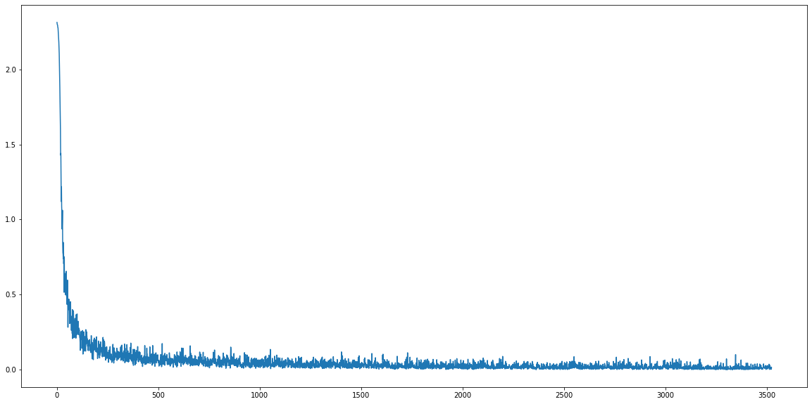

## 定义LeNet-5网络

# LeNet-5网络仿真实现

## LeNet-5网络架构介绍

`LeNet-5`网络架构如下图所示，不包括输入层的话，`LeNet-5`一共有7层，所有的层都有可以训练的参数(权重).

输入的图像是  $32\times32$ 尺寸的点阵图，这比用于训练的数据库中的最大的字符还要大(数据库中的大多数数据尺寸在 $20\times20$​​​​)。这样做的原因是期望识别到潜在的区别特征，例如笔划终点或转角可以出现在最高水平特征检测器的感受野的中心。在 $32\times32$​的输入数据中，LeNet-5网络的最后一层卷积层的感受野中心形成 $20\times20$​的区域。

输入的数据经过归一化，白色的点在-0.1，黑色的点在1.175，这样让输入的平均值在0左右，方差在1左右，可以加速学习。


这个网络架构虽然比较小，但是也包含了深度学习的主要的基本模块：

### input layer

数据输入层，将输入图像尺寸统一并归一化为 $32\times32$

### c1卷积层(convolutional layer)

* 输入：$32 \times 32$

* 卷积核大小：$5\times5, s=1$​

* 卷积种类：6

* 神经元数量：$28\times28\times6$

* 可训练参数：$(5\times5+1)\times6=156$​ 

  > 每个滤波器 $5\times5=25$​个`unit`参数和一个`bias`参数，一共6个滤波器

* 连接数：$(5\times5+1)\times6\times28\times28=122304$​

  > 卷积层`C1`内的每个像素都与输入图像中的 $5\times5$​个像素和1个bias有连接，所以总共有 $156\times28\times28=12304$​ 个连接点

> 对输入图像进行第一次卷积运算（使用 6 个大小为 $5\times5$​​​​ 的卷积核），得到6个`C1`特征图（6个大小为$28\times28$​​的 `feature maps`, 32-5+1=28）。我们再来看看需要多少个参数，卷积核的大小为$5\times5$​​，总共就有$6\times(5\times5+1)=156$​​​个参数，其中+1是表示一个核有一个`bias`。对于卷积层`C1`，`C1`内的每个像素都与输入图像中的$5\times5$​​个像素和1个`bias`有连接，所以总共有$156\times28\times28=122304$​​​个连接（connection）。有122304个连接，但是我们只需要学习156个参数，主要是通过权值共享实现的。

### S2池化层(sub-sampS2ling layer)

* 输入：$28\times28$
* 采样区域：$2\times2$
* 采样方式：4个输入相加，乘以一个可训练参数，再加上一个可训练偏置。结果通过`sigmoid`函数
* 采样种类：6
* 输出`featureMap`大小：$14\times14(28/2)$​
* 神经元数量：$14\times14\times6$​
* 可训练参数：$2\times6$​(和的权+偏置)
* 连接数：$(2\times2+1)\times6\times14\times14$​
* `S2`中每个特征图的大小是`C1`中特征图大小的1/4。

> 第一次卷积之后紧接着就是池化运算，使用 $2\times 2$​​​核进行池化，于是得到了`S2`，6个$14\times14$​​​​的特征图（28/2=14）。`S2`这个pooling层是对C1中的 $2\times2$​​​​ 区域内的像素求和乘以一个权值系数再加上一个偏置，然后将这个结果再做一次映射。于是每个池化核有两个训练参数，所以共有2x6=12个训练参数，但是有5x14x14x6=5880个连接。

### C3卷积层(convolutional layer)

* `S2`中所有6个或者几个特征`map`组合
* 卷积核大小：$5\times5$
* 卷积核种类：16
* 输出`featureMap`大小：$10\times10(14-5+1)=10$


`C3`中的每个特征`map`是连接到`S2`中的所有6个或者几个特征`map`的，表示本层的特征`map`是上一层提取到的特征`map`的不同组合。存在的一个方式是：`C3`的前6个特征图以`S2`中3个相邻的特征图子集为输入。接下来6个特征图以`S2`中4个相邻特征图子集为输入。然后的3个以不相邻的4个特征图子集为输入。最后一个将`S2`中所有特征图为输入。则：可训练参数：
$$
6\times(3\times5\times5+1)+6\times(4\times5\times5+1)+3\times(4\times5\times5+1)+\times(6\times5\times5+1)=1516
$$
这种非对称的连接的作用是：

* 非完全连接的方案可以使连接数保持在合理的范围内
* 不同的特征图因为有不同的特征可以提取多种组合

### S4池化层(sub-sampling layer)

* 输入：$10\times10$
* 采样区域：$2\times2$
* 采样方式：4个输入相加，乘以一个可训练参数，再加上一个可训练偏置。结果通过`sigmoid`
* 采样种类：16
* 输出`featureMap`大小：$5\times5$
* 神经元数量：$5\times5\times16=400$
* 可训练参数：$2\times16=32$
* 连接数：$16\times(2\times2+1)\times5\times5=2000$​
* `S4`中每个特征图的大小是`C3`中特征图大小的1/4

> `S4`是`pooling`层，窗口大小仍然是$2\times2$​​​，共计16个`feature map`，`C3`层的16个$10\times10$​​​的图分别进行以$2\times2$​​​为单位的池化得到16个 $5\times5$​​​ 的特征图。这一层有2x16共32个训练参数，$5\times5\times5\times16=2000$​​ 个连接。连接的方式与`S2`层类似。

### C5卷积层(convolutional layer)

* 输入：`S4`层的全部16个单元`featureMap`(与`S4`全相连)
* 卷积核大小：$5\times5$
* 卷积核种类：120
* 输出`featureMap`大小：$1\times1(5-5+1)$
* 可训练参数/连接：$120\times(16\times5\times5+1)=48120$

> `C5`层是一个有120个`featureMap`的卷积层。每一个单元和`S4`的所有16个`featureMap`的 $5\times 5$​ 邻域全连接。因为`S4`的`featureMap`是 $5 \times 5$ ，所以`C5`的`featureMap`是 $1\times1$ 。

### F6全连接层(fully-ocnnected layer)

* 输入：`C5` 120维向量
* 计算方式：计算输入向量和权重向量之间的点积，再加上一个偏置，结果通过`sigmoid`函数输出。
* 可训练参数：$84\times(120+1)=10164$

包含84个节点，对应于一个 $7\times12$ 的比特图，$-1$ 表示白色， $1$​ 表示黑色，这样每个符号的比特图的黑白色就对应于一个编码。


### output layer

最后，输出层由欧几里得径向基函数(Euclidean Radial Basis Function)组成，也是全连接层。共有10个节点，分别表示0到9，对于每个`RBF`单元$y_i$的输出：
$$
y_i = \sum_j(x_j-w_{ij})^2
$$

### 总结

现在的大多数神经网络是通过`softmax`函数输出多分类结果，相比于现代版本，这里得到的神经网络会小一些，只有约6万个参数，现在的一些神经网络甚至有一千万到一亿个参数。

从`LeNet-5`网络从左往右看，随着网络越来越深，图像的高度和宽度都在缩小，从最初的 $32\times32$​ 缩小到 $28\times28$​，再到 $14\times14$​、$10\times10$​，最后只用 $5\times5$​，与此同时，随着网络层次的加深，通道数量一直在增加，从1增加到6个，再到16个。

LeNet5网络的特别之处还在于，各个网络之间是有关联的，比如说，你有一个$nH\times nW\times nC$​​ 的网络，有$nC$​​个通道，使用尺寸为$𝑓 × 𝑓 × 𝑛 𝐶 $​的过滤器，每个过滤器的通道数和它上一层的通道数相同。这是由于在当时，计算机的运行速度非常慢，为了减少计算量和参数，经典的 `LeNet-5 `网络使用了非常复杂的计算方式，每个过滤器都采用和输入模块一样的通道数量。

## LeNet-5网络定义


```python
from collections import OrderedDict
import torch.nn as nn
class C1(nn.Module):
    def __init__(self):
        super(C1, self).__init__()

        self.c1 = nn.Sequential(OrderedDict([
            ('c1', nn.Conv2d(1, 6, kernel_size=(5, 5))),
            ('relu1', nn.ReLU()),
            ('s1', nn.MaxPool2d(kernel_size=(2, 2), stride=2))
        ]))

    def forward(self, img):
        output = self.c1(img)
        return output


class C2(nn.Module):
    def __init__(self):
        super(C2, self).__init__()

        self.c2 = nn.Sequential(OrderedDict([
            ('c2', nn.Conv2d(6, 16, kernel_size=(5, 5))),
            ('relu2', nn.ReLU()),
            ('s2', nn.MaxPool2d(kernel_size=(2, 2), stride=2))
        ]))

    def forward(self, img):
        output = self.c2(img)
        return output


class C3(nn.Module):
    def __init__(self):
        super(C3, self).__init__()

        self.c3 = nn.Sequential(OrderedDict([
            ('c3', nn.Conv2d(16, 120, kernel_size=(5, 5))),
            ('relu3', nn.ReLU())
        ]))

    def forward(self, img):
        output = self.c3(img)
        return output


class F4(nn.Module):
    def __init__(self):
        super(F4, self).__init__()

        self.f4 = nn.Sequential(OrderedDict([
            ('f4', nn.Linear(120, 84)),
            ('relu4', nn.ReLU())
        ]))

    def forward(self, img):
        output = self.f4(img)
        return output


class F5(nn.Module):
    def __init__(self):
        super(F5, self).__init__()

        self.f5 = nn.Sequential(OrderedDict([
            ('f5', nn.Linear(84, 10)),
            ('sig5', nn.LogSoftmax(dim=-1))
        ]))

    def forward(self, img):
        output = self.f5(img)
        return output


class LeNet5(nn.Module):
    """
    Input - 1x32x32
    Output - 10
    """
    def __init__(self):
        super(LeNet5, self).__init__()

        self.c1 = C1()
        self.c2_1 = C2() 
        self.c2_2 = C2() 
        self.c3 = C3() 
        self.f4 = F4() 
        self.f5 = F5() 

    def forward(self, img):
        output = self.c1(img)

        x = self.c2_1(output)
        output = self.c2_2(output)

        output += x

        output = self.c3(output)
        output = output.view(img.size(0), -1)
        output = self.f4(output)
        output = self.f5(output)
        return output

```

## 数据准备

使用的数据是MNIST的手写字符集，可以直接通过`torchvision.datasets.mnist`获取


```python
from torchvision.datasets.mnist import MNIST
from lenet import LeNet5
import torch
import torch.optim as optim
from torchvision.datasets.mnist import MNIST
import torchvision.transforms as transforms
from torch.utils.data import DataLoader
import visdom
import onnx
device = torch.device("cuda:0" if torch.cuda.is_available() else "cpu")
```


```python
viz = visdom.Visdom()
```

    Setting up a new session...


```python
data_train = MNIST('./data/mnist', 
                    download=True,
                    transform=transforms.transforms.Compose([
                        transforms.Resize((32, 32)), 
                        transforms.transforms.ToTensor()
                    ]))
data_test = MNIST('./data/mnist',
                    train=False,
                    download=True,
                    transform=transforms.transforms.Compose([
                        transforms.Resize((32, 32)),
                        transforms.ToTensor()])
                    )
```

    /home/madao/anaconda3/envs/python3.6env/lib/python3.6/site-packages/torchvision/datasets/mnist.py:498: UserWarning: The given NumPy array is not writeable, and PyTorch does not support non-writeable tensors. This means you can write to the underlying (supposedly non-writeable) NumPy array using the tensor. You may want to copy the array to protect its data or make it writeable before converting it to a tensor. This type of warning will be suppressed for the rest of this program. (Triggered internally at  /pytorch/torch/csrc/utils/tensor_numpy.cpp:180.)
      return torch.from_numpy(parsed.astype(m[2], copy=False)).view(*s)


```python
data_train_loader = DataLoader(data_train, batch_size=256, shuffle=True, num_workers=8)
data_test_loader = DataLoader(data_test, batch_size=1024, num_workers=8)
```


```python
net = LeNet5().to(device)
criterion = nn.CrossEntropyLoss()
optimizer = optim.Adam(net.parameters(), lr=2e-3)
cur_batch_win = None
cur_batch_win_opts = {
    'title': 'Epoch Loss Trace',
    'xlabel': 'Batch Number',
    'ylabel': 'Loss',
    'width': 1200,
    'height': 600,
}
```


```python
def train(epoch):
    global cur_batch_win
    global train_loss
    net.train()
    loss_list, batch_list = [], []
    for i, (images, labels) in enumerate(data_train_loader):
        optimizer.zero_grad()
        images = images.to(device)
        labels = labels.to(device)
        output = net(images)

        loss = criterion(output, labels)

        loss_list.append(loss.detach().cpu())
        batch_list.append(i+1)

        if i % 10 == 0:
            print('Train - Epoch %d, Batch: %d, Loss: %f' % (epoch, i, loss.detach().cpu().item()))

        # Update Visualization
        if viz.check_connection():
            cur_batch_win = viz.line(torch.Tensor(loss_list), torch.Tensor(batch_list),
                                     win=cur_batch_win, name='current_batch_loss',
                                     update=(None if cur_batch_win is None else 'replace'),
                                     opts=cur_batch_win_opts)

        loss.backward()
        optimizer.step()
    return loss_list

```


```python
def test():
    net.eval()
    total_correct = 0
    avg_loss = 0.0

    for i, (images, labels) in enumerate(data_test_loader):
        images = images.to(device)
        labels = labels.to(device)
        output = net(images)

        avg_loss += criterion(output, labels).sum()
        pred = output.detach().cpu().max(1)[1]
        total_correct += pred.eq(labels.cpu().view_as(pred)).sum()

    avg_loss /= len(data_test)
    print('Test Avg. Loss: %f, Accuracy: %f' % (avg_loss.detach().cpu().item(), float(total_correct) / len(data_test)))

```


```python
def train_and_test(epoch):
    train_loss = train(epoch)
    test()

    dummy_input = torch.randn(1, 1, 32, 32, requires_grad=True).to(device)
    torch.onnx.export(net, dummy_input, "lenet.onnx")

    onnx_model = onnx.load("lenet.onnx")
    onnx.checker.check_model(onnx_model)
    return train_loss
```


```python
def main():
    train_losss = list()
    for e in range(1, 16):
        train_loss = train_and_test(e)
        for loss in train_loss:
            train_losss.append(loss)
    return train_losss
```


```python
train_loss = main()
```

    /home/madao/anaconda3/envs/python3.6env/lib/python3.6/site-packages/torch/nn/functional.py:718: UserWarning: Named tensors and all their associated APIs are an experimental feature and subject to change. Please do not use them for anything important until they are released as stable. (Triggered internally at  /pytorch/c10/core/TensorImpl.h:1156.)
      return torch.max_pool2d(input, kernel_size, stride, padding, dilation, ceil_mode)


    Train - Epoch 1, Batch: 0, Loss: 2.311965
    Train - Epoch 1, Batch: 10, Loss: 2.142133
    Train - Epoch 1, Batch: 20, Loss: 1.255652
    Train - Epoch 1, Batch: 30, Loss: 0.770596
    Train - Epoch 1, Batch: 40, Loss: 0.534266
    Train - Epoch 1, Batch: 50, Loss: 0.442306
    Train - Epoch 1, Batch: 60, Loss: 0.468153
    Train - Epoch 1, Batch: 70, Loss: 0.356581
    Train - Epoch 1, Batch: 80, Loss: 0.269619
    Train - Epoch 1, Batch: 90, Loss: 0.256702
    Train - Epoch 1, Batch: 100, Loss: 0.273830
    Train - Epoch 1, Batch: 110, Loss: 0.266757
    Train - Epoch 1, Batch: 120, Loss: 0.200562
    Train - Epoch 1, Batch: 130, Loss: 0.222001
    Train - Epoch 1, Batch: 140, Loss: 0.204945
    Train - Epoch 1, Batch: 150, Loss: 0.205453
    Train - Epoch 1, Batch: 160, Loss: 0.179718
    Train - Epoch 1, Batch: 170, Loss: 0.179102
    Train - Epoch 1, Batch: 180, Loss: 0.135494
    Train - Epoch 1, Batch: 190, Loss: 0.136008
    Train - Epoch 1, Batch: 200, Loss: 0.074584
    Train - Epoch 1, Batch: 210, Loss: 0.078482
    Train - Epoch 1, Batch: 220, Loss: 0.134642
    Train - Epoch 1, Batch: 230, Loss: 0.118460
    Test Avg. Loss: 0.000105, Accuracy: 0.966500
    Train - Epoch 2, Batch: 0, Loss: 0.176212
    Train - Epoch 2, Batch: 10, Loss: 0.153552
    Train - Epoch 2, Batch: 20, Loss: 0.066817
    Train - Epoch 2, Batch: 30, Loss: 0.065422
    Train - Epoch 2, Batch: 40, Loss: 0.154351
    Train - Epoch 2, Batch: 50, Loss: 0.097159
    Train - Epoch 2, Batch: 60, Loss: 0.143552
    Train - Epoch 2, Batch: 70, Loss: 0.077929
    Train - Epoch 2, Batch: 80, Loss: 0.062687
    Train - Epoch 2, Batch: 90, Loss: 0.093121
    Train - Epoch 2, Batch: 100, Loss: 0.046552
    Train - Epoch 2, Batch: 110, Loss: 0.167599
    Train - Epoch 2, Batch: 120, Loss: 0.110213
    Train - Epoch 2, Batch: 130, Loss: 0.065434
    Train - Epoch 2, Batch: 140, Loss: 0.136412
    Train - Epoch 2, Batch: 150, Loss: 0.032096
    Train - Epoch 2, Batch: 160, Loss: 0.089830
    Train - Epoch 2, Batch: 170, Loss: 0.120529
    Train - Epoch 2, Batch: 180, Loss: 0.080730
    Train - Epoch 2, Batch: 190, Loss: 0.081082
    Train - Epoch 2, Batch: 200, Loss: 0.061742
    Train - Epoch 2, Batch: 210, Loss: 0.104012
    Train - Epoch 2, Batch: 220, Loss: 0.075414
    Train - Epoch 2, Batch: 230, Loss: 0.054316
    Test Avg. Loss: 0.000067, Accuracy: 0.978800
    Train - Epoch 3, Batch: 0, Loss: 0.066542
    Train - Epoch 3, Batch: 10, Loss: 0.057625
    Train - Epoch 3, Batch: 20, Loss: 0.062523
    Train - Epoch 3, Batch: 30, Loss: 0.052255
    Train - Epoch 3, Batch: 40, Loss: 0.080742
    Train - Epoch 3, Batch: 50, Loss: 0.042895
    Train - Epoch 3, Batch: 60, Loss: 0.083007
    Train - Epoch 3, Batch: 70, Loss: 0.074603
    Train - Epoch 3, Batch: 80, Loss: 0.055068
    Train - Epoch 3, Batch: 90, Loss: 0.030841
    Train - Epoch 3, Batch: 100, Loss: 0.048446
    Train - Epoch 3, Batch: 110, Loss: 0.090024
    Train - Epoch 3, Batch: 120, Loss: 0.079241
    Train - Epoch 3, Batch: 130, Loss: 0.071417
    Train - Epoch 3, Batch: 140, Loss: 0.060021
    Train - Epoch 3, Batch: 150, Loss: 0.058526
    Train - Epoch 3, Batch: 160, Loss: 0.081278
    Train - Epoch 3, Batch: 170, Loss: 0.050955
    Train - Epoch 3, Batch: 180, Loss: 0.085286
    Train - Epoch 3, Batch: 190, Loss: 0.046122
    Train - Epoch 3, Batch: 200, Loss: 0.027791
    Train - Epoch 3, Batch: 210, Loss: 0.094474
    Train - Epoch 3, Batch: 220, Loss: 0.067521
    Train - Epoch 3, Batch: 230, Loss: 0.034245
    Test Avg. Loss: 0.000054, Accuracy: 0.983600
    Train - Epoch 4, Batch: 0, Loss: 0.048238
    Train - Epoch 4, Batch: 10, Loss: 0.047161
    Train - Epoch 4, Batch: 20, Loss: 0.057948
    Train - Epoch 4, Batch: 30, Loss: 0.026137
    Train - Epoch 4, Batch: 40, Loss: 0.055747
    Train - Epoch 4, Batch: 50, Loss: 0.062449
    Train - Epoch 4, Batch: 60, Loss: 0.058243
    Train - Epoch 4, Batch: 70, Loss: 0.041330
    Train - Epoch 4, Batch: 80, Loss: 0.029140
    Train - Epoch 4, Batch: 90, Loss: 0.055626
    Train - Epoch 4, Batch: 100, Loss: 0.048235
    Train - Epoch 4, Batch: 110, Loss: 0.040169
    Train - Epoch 4, Batch: 120, Loss: 0.085681
    Train - Epoch 4, Batch: 130, Loss: 0.053270
    Train - Epoch 4, Batch: 140, Loss: 0.057205
    Train - Epoch 4, Batch: 150, Loss: 0.057303
    Train - Epoch 4, Batch: 160, Loss: 0.083671
    Train - Epoch 4, Batch: 170, Loss: 0.042737
    Train - Epoch 4, Batch: 180, Loss: 0.024824
    Train - Epoch 4, Batch: 190, Loss: 0.047532
    Train - Epoch 4, Batch: 200, Loss: 0.047744
    Train - Epoch 4, Batch: 210, Loss: 0.028160
    Train - Epoch 4, Batch: 220, Loss: 0.114140
    Train - Epoch 4, Batch: 230, Loss: 0.032848
    Test Avg. Loss: 0.000043, Accuracy: 0.985300
    Train - Epoch 5, Batch: 0, Loss: 0.024736
    Train - Epoch 5, Batch: 10, Loss: 0.047569
    Train - Epoch 5, Batch: 20, Loss: 0.077371
    Train - Epoch 5, Batch: 30, Loss: 0.039319
    Train - Epoch 5, Batch: 40, Loss: 0.009624
    Train - Epoch 5, Batch: 50, Loss: 0.036165
    Train - Epoch 5, Batch: 60, Loss: 0.027070
    Train - Epoch 5, Batch: 70, Loss: 0.028656
    Train - Epoch 5, Batch: 80, Loss: 0.049659
    Train - Epoch 5, Batch: 90, Loss: 0.092047
    Train - Epoch 5, Batch: 100, Loss: 0.040482
    Train - Epoch 5, Batch: 110, Loss: 0.032466
    Train - Epoch 5, Batch: 120, Loss: 0.021912
    Train - Epoch 5, Batch: 130, Loss: 0.018135
    Train - Epoch 5, Batch: 140, Loss: 0.046672
    Train - Epoch 5, Batch: 150, Loss: 0.031142
    Train - Epoch 5, Batch: 160, Loss: 0.065423
    Train - Epoch 5, Batch: 170, Loss: 0.076633
    Train - Epoch 5, Batch: 180, Loss: 0.038218
    Train - Epoch 5, Batch: 190, Loss: 0.024578
    Train - Epoch 5, Batch: 200, Loss: 0.044397
    Train - Epoch 5, Batch: 210, Loss: 0.061336
    Train - Epoch 5, Batch: 220, Loss: 0.030748
    Train - Epoch 5, Batch: 230, Loss: 0.026420
    Test Avg. Loss: 0.000039, Accuracy: 0.987100
    Train - Epoch 6, Batch: 0, Loss: 0.044141
    Train - Epoch 6, Batch: 10, Loss: 0.040236
    Train - Epoch 6, Batch: 20, Loss: 0.048378
    Train - Epoch 6, Batch: 30, Loss: 0.024512
    Train - Epoch 6, Batch: 40, Loss: 0.028769
    Train - Epoch 6, Batch: 50, Loss: 0.034363
    Train - Epoch 6, Batch: 60, Loss: 0.049556
    Train - Epoch 6, Batch: 70, Loss: 0.030666
    Train - Epoch 6, Batch: 80, Loss: 0.053802
    Train - Epoch 6, Batch: 90, Loss: 0.083834
    Train - Epoch 6, Batch: 100, Loss: 0.039355
    Train - Epoch 6, Batch: 110, Loss: 0.050084
    Train - Epoch 6, Batch: 120, Loss: 0.035384
    Train - Epoch 6, Batch: 130, Loss: 0.075478
    Train - Epoch 6, Batch: 140, Loss: 0.061034
    Train - Epoch 6, Batch: 150, Loss: 0.017920
    Train - Epoch 6, Batch: 160, Loss: 0.019840
    Train - Epoch 6, Batch: 170, Loss: 0.066182
    Train - Epoch 6, Batch: 180, Loss: 0.023204
    Train - Epoch 6, Batch: 190, Loss: 0.030185
    Train - Epoch 6, Batch: 200, Loss: 0.015153
    Train - Epoch 6, Batch: 210, Loss: 0.040058
    Train - Epoch 6, Batch: 220, Loss: 0.026025
    Train - Epoch 6, Batch: 230, Loss: 0.025254
    Test Avg. Loss: 0.000033, Accuracy: 0.988200
    Train - Epoch 7, Batch: 0, Loss: 0.024070
    Train - Epoch 7, Batch: 10, Loss: 0.024512
    Train - Epoch 7, Batch: 20, Loss: 0.015800
    Train - Epoch 7, Batch: 30, Loss: 0.021826
    Train - Epoch 7, Batch: 40, Loss: 0.035038
    Train - Epoch 7, Batch: 50, Loss: 0.065198
    Train - Epoch 7, Batch: 60, Loss: 0.018621
    Train - Epoch 7, Batch: 70, Loss: 0.053762
    Train - Epoch 7, Batch: 80, Loss: 0.093103
    Train - Epoch 7, Batch: 90, Loss: 0.012917
    Train - Epoch 7, Batch: 100, Loss: 0.038949
    Train - Epoch 7, Batch: 110, Loss: 0.031542
    Train - Epoch 7, Batch: 120, Loss: 0.016538
    Train - Epoch 7, Batch: 130, Loss: 0.065651
    Train - Epoch 7, Batch: 140, Loss: 0.010077
    Train - Epoch 7, Batch: 150, Loss: 0.029399
    Train - Epoch 7, Batch: 160, Loss: 0.034463
    Train - Epoch 7, Batch: 170, Loss: 0.025253
    Train - Epoch 7, Batch: 180, Loss: 0.026345
    Train - Epoch 7, Batch: 190, Loss: 0.039458
    Train - Epoch 7, Batch: 200, Loss: 0.038242
    Train - Epoch 7, Batch: 210, Loss: 0.019514
    Train - Epoch 7, Batch: 220, Loss: 0.030997
    Train - Epoch 7, Batch: 230, Loss: 0.029049
    Test Avg. Loss: 0.000033, Accuracy: 0.989000
    Train - Epoch 8, Batch: 0, Loss: 0.008282
    Train - Epoch 8, Batch: 10, Loss: 0.017794
    Train - Epoch 8, Batch: 20, Loss: 0.033910
    Train - Epoch 8, Batch: 30, Loss: 0.025411
    Train - Epoch 8, Batch: 40, Loss: 0.015167
    Train - Epoch 8, Batch: 50, Loss: 0.021764
    Train - Epoch 8, Batch: 60, Loss: 0.025642
    Train - Epoch 8, Batch: 70, Loss: 0.026746
    Train - Epoch 8, Batch: 80, Loss: 0.083921
    Train - Epoch 8, Batch: 90, Loss: 0.029759
    Train - Epoch 8, Batch: 100, Loss: 0.037689
    Train - Epoch 8, Batch: 110, Loss: 0.039460
    Train - Epoch 8, Batch: 120, Loss: 0.017434
    Train - Epoch 8, Batch: 130, Loss: 0.034581
    Train - Epoch 8, Batch: 140, Loss: 0.063059
    Train - Epoch 8, Batch: 150, Loss: 0.066770
    Train - Epoch 8, Batch: 160, Loss: 0.025287
    Train - Epoch 8, Batch: 170, Loss: 0.015583
    Train - Epoch 8, Batch: 180, Loss: 0.054220
    Train - Epoch 8, Batch: 190, Loss: 0.029341
    Train - Epoch 8, Batch: 200, Loss: 0.030160
    Train - Epoch 8, Batch: 210, Loss: 0.069261
    Train - Epoch 8, Batch: 220, Loss: 0.016770
    Train - Epoch 8, Batch: 230, Loss: 0.026243
    Test Avg. Loss: 0.000032, Accuracy: 0.988500
    Train - Epoch 9, Batch: 0, Loss: 0.025416
    Train - Epoch 9, Batch: 10, Loss: 0.006188
    Train - Epoch 9, Batch: 20, Loss: 0.020386
    Train - Epoch 9, Batch: 30, Loss: 0.018133
    Train - Epoch 9, Batch: 40, Loss: 0.003498
    Train - Epoch 9, Batch: 50, Loss: 0.023414
    Train - Epoch 9, Batch: 60, Loss: 0.068004
    Train - Epoch 9, Batch: 70, Loss: 0.024850
    Train - Epoch 9, Batch: 80, Loss: 0.015137
    Train - Epoch 9, Batch: 90, Loss: 0.023843
    Train - Epoch 9, Batch: 100, Loss: 0.019276
    Train - Epoch 9, Batch: 110, Loss: 0.020706
    Train - Epoch 9, Batch: 120, Loss: 0.017100
    Train - Epoch 9, Batch: 130, Loss: 0.032251
    Train - Epoch 9, Batch: 140, Loss: 0.006080
    Train - Epoch 9, Batch: 150, Loss: 0.022148
    Train - Epoch 9, Batch: 160, Loss: 0.031210
    Train - Epoch 9, Batch: 170, Loss: 0.002495
    Train - Epoch 9, Batch: 180, Loss: 0.033352
    Train - Epoch 9, Batch: 190, Loss: 0.029081
    Train - Epoch 9, Batch: 200, Loss: 0.007669
    Train - Epoch 9, Batch: 210, Loss: 0.007551
    Train - Epoch 9, Batch: 220, Loss: 0.015849
    Train - Epoch 9, Batch: 230, Loss: 0.020666
    Test Avg. Loss: 0.000036, Accuracy: 0.988300
    Train - Epoch 10, Batch: 0, Loss: 0.010589
    Train - Epoch 10, Batch: 10, Loss: 0.018612
    Train - Epoch 10, Batch: 20, Loss: 0.017199
    Train - Epoch 10, Batch: 30, Loss: 0.010294
    Train - Epoch 10, Batch: 40, Loss: 0.028546
    Train - Epoch 10, Batch: 50, Loss: 0.013994
    Train - Epoch 10, Batch: 60, Loss: 0.008827
    Train - Epoch 10, Batch: 70, Loss: 0.016255
    Train - Epoch 10, Batch: 80, Loss: 0.009431
    Train - Epoch 10, Batch: 90, Loss: 0.014594
    Train - Epoch 10, Batch: 100, Loss: 0.010329
    Train - Epoch 10, Batch: 110, Loss: 0.019751
    Train - Epoch 10, Batch: 120, Loss: 0.019126
    Train - Epoch 10, Batch: 130, Loss: 0.006064
    Train - Epoch 10, Batch: 140, Loss: 0.027301
    Train - Epoch 10, Batch: 150, Loss: 0.043245
    Train - Epoch 10, Batch: 160, Loss: 0.044680
    Train - Epoch 10, Batch: 170, Loss: 0.006976
    Train - Epoch 10, Batch: 180, Loss: 0.034920
    Train - Epoch 10, Batch: 190, Loss: 0.023426
    Train - Epoch 10, Batch: 200, Loss: 0.036866
    Train - Epoch 10, Batch: 210, Loss: 0.008415
    Train - Epoch 10, Batch: 220, Loss: 0.044059
    Train - Epoch 10, Batch: 230, Loss: 0.031490
    Test Avg. Loss: 0.000036, Accuracy: 0.987700
    Train - Epoch 11, Batch: 0, Loss: 0.020564
    Train - Epoch 11, Batch: 10, Loss: 0.011271
    Train - Epoch 11, Batch: 20, Loss: 0.049623
    Train - Epoch 11, Batch: 30, Loss: 0.028951
    Train - Epoch 11, Batch: 40, Loss: 0.014797
    Train - Epoch 11, Batch: 50, Loss: 0.006550
    Train - Epoch 11, Batch: 60, Loss: 0.013403
    Train - Epoch 11, Batch: 70, Loss: 0.011401
    Train - Epoch 11, Batch: 80, Loss: 0.020940
    Train - Epoch 11, Batch: 90, Loss: 0.013957
    Train - Epoch 11, Batch: 100, Loss: 0.001513
    Train - Epoch 11, Batch: 110, Loss: 0.009929
    Train - Epoch 11, Batch: 120, Loss: 0.010340
    Train - Epoch 11, Batch: 130, Loss: 0.042369
    Train - Epoch 11, Batch: 140, Loss: 0.005425
    Train - Epoch 11, Batch: 150, Loss: 0.009119
    Train - Epoch 11, Batch: 160, Loss: 0.038966
    Train - Epoch 11, Batch: 170, Loss: 0.003163
    Train - Epoch 11, Batch: 180, Loss: 0.017247
    Train - Epoch 11, Batch: 190, Loss: 0.037625
    Train - Epoch 11, Batch: 200, Loss: 0.086759
    Train - Epoch 11, Batch: 210, Loss: 0.030909
    Train - Epoch 11, Batch: 220, Loss: 0.032017
    Train - Epoch 11, Batch: 230, Loss: 0.048916
    Test Avg. Loss: 0.000033, Accuracy: 0.989800
    Train - Epoch 12, Batch: 0, Loss: 0.027991
    Train - Epoch 12, Batch: 10, Loss: 0.007180
    Train - Epoch 12, Batch: 20, Loss: 0.011618
    Train - Epoch 12, Batch: 30, Loss: 0.009657
    Train - Epoch 12, Batch: 40, Loss: 0.003374
    Train - Epoch 12, Batch: 50, Loss: 0.019330
    Train - Epoch 12, Batch: 60, Loss: 0.015131
    Train - Epoch 12, Batch: 70, Loss: 0.040882
    Train - Epoch 12, Batch: 80, Loss: 0.008052
    Train - Epoch 12, Batch: 90, Loss: 0.006585
    Train - Epoch 12, Batch: 100, Loss: 0.028739
    Train - Epoch 12, Batch: 110, Loss: 0.009761
    Train - Epoch 12, Batch: 120, Loss: 0.019616
    Train - Epoch 12, Batch: 130, Loss: 0.011868
    Train - Epoch 12, Batch: 140, Loss: 0.009689
    Train - Epoch 12, Batch: 150, Loss: 0.005598
    Train - Epoch 12, Batch: 160, Loss: 0.004077
    Train - Epoch 12, Batch: 170, Loss: 0.015676
    Train - Epoch 12, Batch: 180, Loss: 0.014377
    Train - Epoch 12, Batch: 190, Loss: 0.004340
    Train - Epoch 12, Batch: 200, Loss: 0.038935
    Train - Epoch 12, Batch: 210, Loss: 0.035879
    Train - Epoch 12, Batch: 220, Loss: 0.024816
    Train - Epoch 12, Batch: 230, Loss: 0.012925
    Test Avg. Loss: 0.000033, Accuracy: 0.989100
    Train - Epoch 13, Batch: 0, Loss: 0.022052
    Train - Epoch 13, Batch: 10, Loss: 0.012797
    Train - Epoch 13, Batch: 20, Loss: 0.013350
    Train - Epoch 13, Batch: 30, Loss: 0.023859
    Train - Epoch 13, Batch: 40, Loss: 0.033041
    Train - Epoch 13, Batch: 50, Loss: 0.037284
    Train - Epoch 13, Batch: 60, Loss: 0.019953
    Train - Epoch 13, Batch: 70, Loss: 0.003509
    Train - Epoch 13, Batch: 80, Loss: 0.005512
    Train - Epoch 13, Batch: 90, Loss: 0.010827
    Train - Epoch 13, Batch: 100, Loss: 0.013831
    Train - Epoch 13, Batch: 110, Loss: 0.014214
    Train - Epoch 13, Batch: 120, Loss: 0.015369
    Train - Epoch 13, Batch: 130, Loss: 0.024683
    Train - Epoch 13, Batch: 140, Loss: 0.029714
    Train - Epoch 13, Batch: 150, Loss: 0.003146
    Train - Epoch 13, Batch: 160, Loss: 0.019133
    Train - Epoch 13, Batch: 170, Loss: 0.016122
    Train - Epoch 13, Batch: 180, Loss: 0.016242
    Train - Epoch 13, Batch: 190, Loss: 0.049664
    Train - Epoch 13, Batch: 200, Loss: 0.015133
    Train - Epoch 13, Batch: 210, Loss: 0.028728
    Train - Epoch 13, Batch: 220, Loss: 0.026338
    Train - Epoch 13, Batch: 230, Loss: 0.017409
    Test Avg. Loss: 0.000025, Accuracy: 0.992200
    Train - Epoch 14, Batch: 0, Loss: 0.003295
    Train - Epoch 14, Batch: 10, Loss: 0.034162
    Train - Epoch 14, Batch: 20, Loss: 0.009937
    Train - Epoch 14, Batch: 30, Loss: 0.005851
    Train - Epoch 14, Batch: 40, Loss: 0.016461
    Train - Epoch 14, Batch: 50, Loss: 0.015125
    Train - Epoch 14, Batch: 60, Loss: 0.017636
    Train - Epoch 14, Batch: 70, Loss: 0.035415
    Train - Epoch 14, Batch: 80, Loss: 0.026546
    Train - Epoch 14, Batch: 90, Loss: 0.029204
    Train - Epoch 14, Batch: 100, Loss: 0.022895
    Train - Epoch 14, Batch: 110, Loss: 0.020067
    Train - Epoch 14, Batch: 120, Loss: 0.004506
    Train - Epoch 14, Batch: 130, Loss: 0.008805
    Train - Epoch 14, Batch: 140, Loss: 0.007999
    Train - Epoch 14, Batch: 150, Loss: 0.003335
    Train - Epoch 14, Batch: 160, Loss: 0.004733
    Train - Epoch 14, Batch: 170, Loss: 0.009495
    Train - Epoch 14, Batch: 180, Loss: 0.006398
    Train - Epoch 14, Batch: 190, Loss: 0.009070
    Train - Epoch 14, Batch: 200, Loss: 0.006565
    Train - Epoch 14, Batch: 210, Loss: 0.020091
    Train - Epoch 14, Batch: 220, Loss: 0.013111
    Train - Epoch 14, Batch: 230, Loss: 0.019667
    Test Avg. Loss: 0.000035, Accuracy: 0.989700
    Train - Epoch 15, Batch: 0, Loss: 0.015832
    Train - Epoch 15, Batch: 10, Loss: 0.000755
    Train - Epoch 15, Batch: 20, Loss: 0.022132
    Train - Epoch 15, Batch: 30, Loss: 0.026901
    Train - Epoch 15, Batch: 40, Loss: 0.007520
    Train - Epoch 15, Batch: 50, Loss: 0.003284
    Train - Epoch 15, Batch: 60, Loss: 0.022684
    Train - Epoch 15, Batch: 70, Loss: 0.004368
    Train - Epoch 15, Batch: 80, Loss: 0.015036
    Train - Epoch 15, Batch: 90, Loss: 0.008023
    Train - Epoch 15, Batch: 100, Loss: 0.021108
    Train - Epoch 15, Batch: 110, Loss: 0.027633
    Train - Epoch 15, Batch: 120, Loss: 0.009627
    Train - Epoch 15, Batch: 130, Loss: 0.004858
    Train - Epoch 15, Batch: 140, Loss: 0.010220
    Train - Epoch 15, Batch: 150, Loss: 0.005526
    Train - Epoch 15, Batch: 160, Loss: 0.005549
    Train - Epoch 15, Batch: 170, Loss: 0.017708
    Train - Epoch 15, Batch: 180, Loss: 0.008478
    Train - Epoch 15, Batch: 190, Loss: 0.002881
    Train - Epoch 15, Batch: 200, Loss: 0.008359
    Train - Epoch 15, Batch: 210, Loss: 0.019088
    Train - Epoch 15, Batch: 220, Loss: 0.011107
    Train - Epoch 15, Batch: 230, Loss: 0.005971
    Test Avg. Loss: 0.000034, Accuracy: 0.990200


```python
import matplotlib.pyplot as plt
```


```python
plt.figure(figsize=(20, 10))
plt.plot(train_loss)
```


    [<matplotlib.lines.Line2D at 0x7fe88e106b38>]


    

    


```python

```
