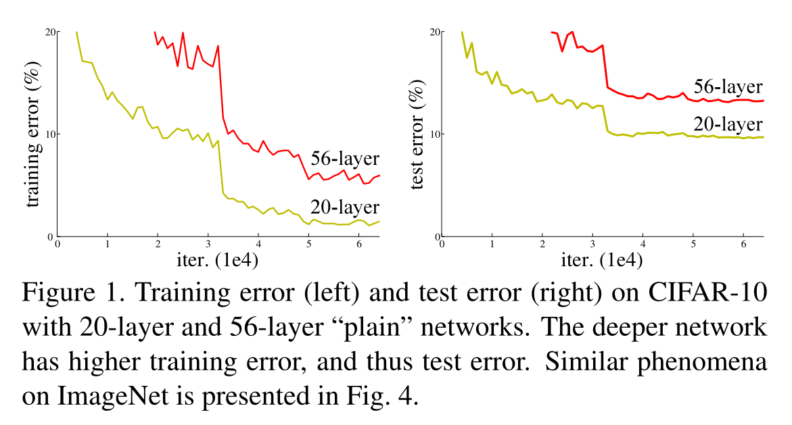
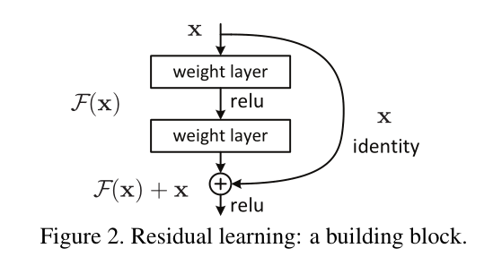
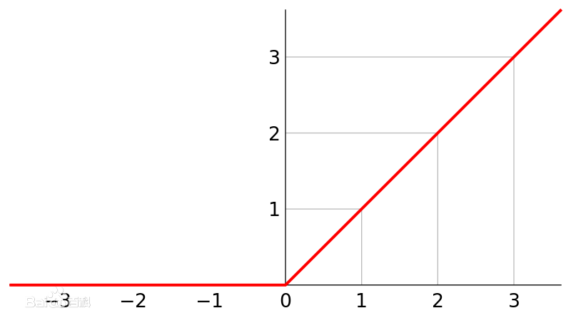

# ResNet学习笔记

## 前言

深度残差网络（Deep Residual Network）是cnn机器视觉史上的一件里程碑的事件，在2015年，ResNet在ImageNet和COCO数据集上获得了非常优秀的成绩。如下图所示：

* ImageNet Classification: “Ultra-deep”`152-layer` nets
* ImageNet Detection: `16%` better than 2nd
* ImageNet Localization: `27%` better than 2nd
* COCO Detection: `11%` better than 2nd
* COCO Segmentation: `12%` better than 2nd

ResNet获得了五项第一，再一次的刷新了CNN模型在ImageNet上的历史[[1]](#ref-1)，而论文的作者[何凯明](http://kaiminghe.com/)也获得了CVPR2016最佳论文奖[[2]](#ref-2)。以下是记录了解ResNet的一些笔记，主要是来自于15年和16年何凯明所在的微软研究院发表的论文。

## 深度网络退化问题（degradation problem of deep network）

从`AlexNet`到`GoogLeNet`，看起来好像是网络越深越好，但是直接秉持着`We need go deeper`的思想构建神经网络，到最后会发现，随着网络越来越深，会出现**梯度消失（vanishing gradients）**和**梯度爆炸（exploding gradients）**以及**网络退化（network degradation）**：

* **梯度消失和爆炸（vanishing/exploding gradients）**：网络层数太深引发的梯度方向传播中的连乘效应引起
* **网络退化（network degradation）**：较深的模型可以看作是较浅模型的超空间，理论上较深的模型可以看作是较浅模型的恒等映射，但是实际上较深模型后面添加的不是恒等映射，而是一些非线性层[[3]](#ref-3)

对于梯度消失和爆炸的应对方法如下：

* **改换激活函数**: 使用`relu`、`LeakyRelu`、`ELU`等激活函数可以改善梯度消散或爆炸问题。`relu`导数的正数部分恒等于1，所以不会产生梯度消失和梯度爆炸
* **BatchNormalization**: 对每一层的输入做scale和shift方法，将每层神经元的输入分布强行拉回均值为0、方差为1的标准正态分布，这就使得激活层输入值落入在非线性函数对输入值比较敏感的区域，使得输入的小变化会导致损失函数较大的变化，使得梯度变大，训练速度加快，且避免梯度消失问题
* **梯度剪切**: 该方法主要是针对梯度爆炸提出。其思想是设置一个梯度剪切阈值，更新梯度时，如果梯度超过这个阈值，那么限制其在这个范围之内

但是随着网络的加深，可以看到的是训练误差和测试误差都开始增加，这自然不是过拟合引起的，而是网络出现退化[[4]](#ref-4)，如[figure1](#fig-1)所示：

网络退化表明了并非所有系统都同样容易优化。考虑一个较深的网络和一个较浅的网络，更深的网络对应更浅的网络相当于是增加了更多的层，添加的层可以是恒等映射（identity mapping），而其他的层是相当于是更浅的模型中直接复制的，这种构造容易得到，较深的模型不会产生比较浅的模型更高的训练误差，但是实验表明，简单地加深网络模型会出现网络退化的问题。

## 残差块（Residual block）

网络退化出现的原因就是**现有的网络无法实现恒等映射**，将想要得到的恒等映射函数表示为 $H(x)=x$，残差块网络设计为 $H(x)=F(x)+x$，即直接将恒等映射作为网络的一部分，就可以将问题转化为学习一个残差函数 $F(x)=H(x)-x$，那么只要 $F(x)=0$，就可以构成一个恒等映射 $H(x)=x$，拟合残差比拟合恒等映射容易的多[[5]](#ref-5)。从数学上更加详细地描述残差结构，可以是：

$$
y=F(x, W_i)+x
$$

其中 $x$ 和 $y$ 表示的分别是所考虑的层的输入和输出向量，函数 $F(x, W_i)$ 表示要学习的残差映射，操作 $F(x, W_i)+x$ 是通过跳接实现，在[方程1](#eqn-1)中 $x$ 和 $F$ 的维度必须相同，否则，需要对跳接进行线性投影 $W_s$ 来匹配维度：

$$
y=F(x, W_i)+W_s x
$$

* $F(x)+x$ 的公式可以通过具有跳接（shortcut connections）的前馈神经网络来实现，跳接可以是跳过一层或者多层的连接，通过跳接在激活函数前，将上一层或几层的输出与本层输出相加，将求和结果输入到激活函数作为本层的输出，残差块示例如[figure2](#fig-2)所示

* 跳接只是执行**恒等映射**，他们的输出被添加到堆叠层的输出中，这不会增加额外的参数，也不会增加计算复杂性

* 添加了残差网络，可以给神经网络一个多的选择，例如**学习到的一层的参数是冗余的，那么就可以直接走跳接路线，跳过这个冗余层**，而不用去拟合参数使得输出 $H(x)=x$

* **学习残差的计算量比学习输出等于输入小**：例如普通网络为A，残差网络为B，输入为2，输出为2，那么普通网络就是$A(2)=2$，而残差网络就是$B(2)=F(2)+2=2$，即残差网络中$F(2)=0$。一般网络会将**权重初始化为0附近的数**，所以让$F(2)$拟合0会比$A(2)=2$容易

* **ReLU能够将负数激活为0**，正数等于输出，这相当于过滤了负数的线性变化，让$F(x)=0$变的更加容易

  

* 对残差网络$H(x)=F(x)+x$求梯度，即反向传播时，得到$H'(x)=F'(x)+1$，**残差结构的这个常数1能够保证求梯度的时候梯度不会消失**

* 这种结构不仅适用于全连接层，还**适用于卷积层，逐通道地对两个特征图执行元素相加**

## 网络架构

网络结构如[figure3](#fig-3)所示，从左到右分别是VGG-19、34层不带残差的plain net、34层的残差网络

## 参考文献

- [1] [知乎文章：你必须要知道CNN模型：ResNet](https://zhuanlan.zhihu.com/p/31852747/)

- [2] [何凯明个人主页](http://kaiminghe.com/)

- [3] [csdn博客：网络退化、过拟合、梯度消散/爆炸](https://blog.csdn.net/c2250645962/article/details/102838830)

- [4] [He K ,  Zhang X ,  Ren S , et al. Deep Residual Learning for Image Recognition[J]. 2016 IEEE Conference on Computer Vision and Pattern Recognition (CVPR), 2016.](https://arxiv.org/pdf/1512.03385.pdf)

- [5] [知乎文章：CVPR2016:ResNet 从根本上解决深度网络退化问题](https://zhuanlan.zhihu.com/p/106764370)

