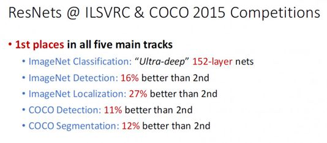

# ResNet学习笔记

## 前言

深度残差网络（Deep Residual Network）是cnn机器视觉史上的一件里程碑的事件，在2015年，ResNet在ImageNet和COCO数据集上获得了非常优秀的成绩。如下图所示：

ResNet获得了五项第一，再一次的刷新了CNN模型在ImageNet上的历史[[1]](#ref-1)，而论文的作者[何凯明](http://kaiminghe.com/)也获得了CVPR2016最佳论文奖[[2]](#ref-2)。以下是记录了解ResNet的一些笔记，主要是来自于15年和16年何凯明所在的微软研究院发表的论文。

## 深度网络退化问题（degradation problem of deep network）

从AlexNet到GoogLeNet，看起来好像是网络越深越好，但是直接秉持着“We need go deeper”的思想构建神经网络，到最后会发现，随着网络越来越深，网络准确度出现饱和。

## 参考文献

- [1] [知乎文章：你必须要知道CNN模型：ResNet](https://zhuanlan.zhihu.com/p/31852747/)

- [2] [何凯明个人主页](http://kaiminghe.com/)