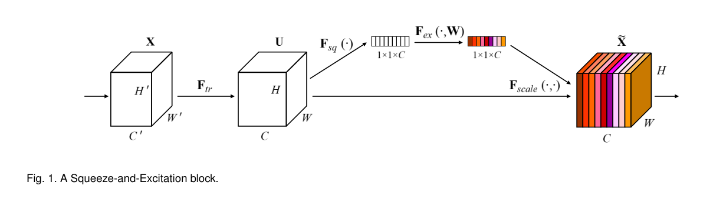
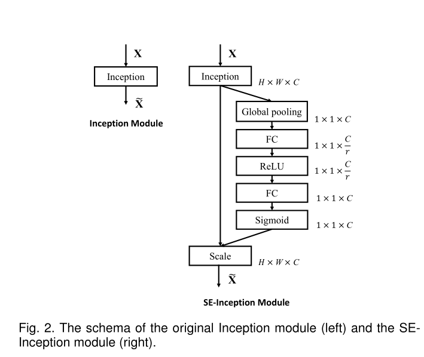
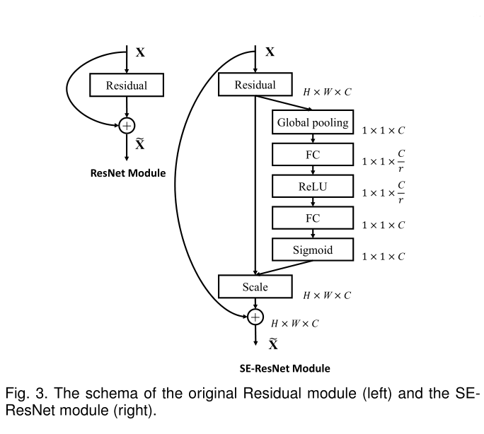
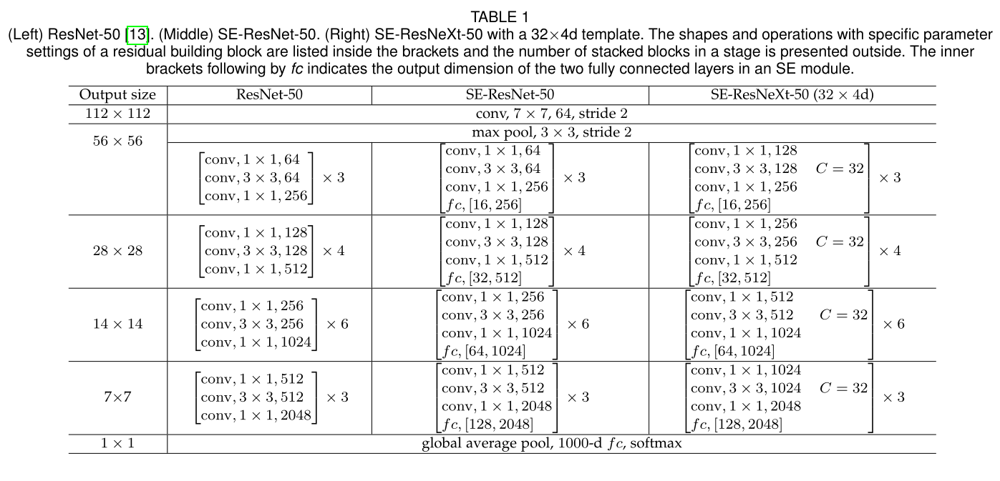
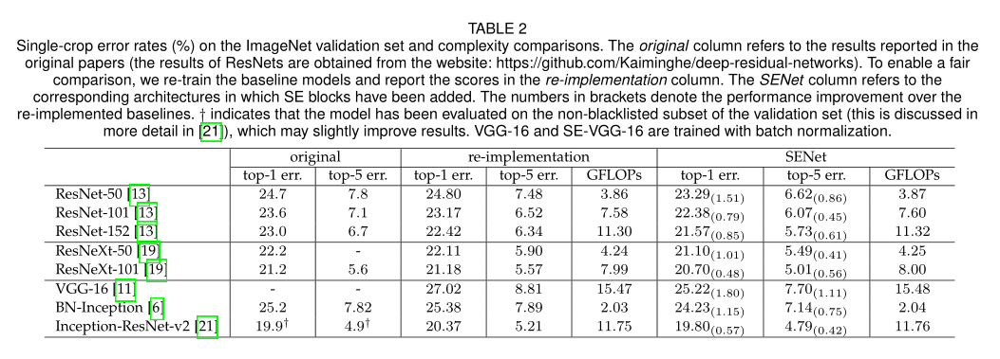

# SeNet学习笔记及仿真

## 前言

SENet[[1]](#ref-1)是ImageNet 2017年的冠军模型，自SeNet提出后，ImageNet挑战赛就停止举办了。SENet同之前的ResNet一样，引入了一些技巧，可以在很大程度上降低模型的参数，并且提升模型的运算速度。

SENet全称Squeeze-and-Excitation Networks，中文名可以翻译为挤压和激励网络。SENet在ImageNet 2017取得了第一名的成绩，Top-5 error rate降低到了2.251%，官方的模型和代码在github仓库中可以找到[[2]](#ref-2)。

## SE block

SENet提出的动机是将通道之间的关系结合起来，于是引出了一个*Squeeze-and-excitation*（SE）块[[1]](#ref-1)，它的目的就是**通过显式建模网络卷积特征的信道之间的相互依赖性来提高网络表征的质量**。SE块的机制也可以说是**通过学习全局信息来选择性地强调有用的特征和抑制不太有用的特征**，SENet块如[fig1](#fig-1)所示。

SE模块可以看作是一个计算单元，用 $F_{tr}$ 表示，可以将输入 $X \in \R^{H' \times W' \times C'}$​ 映射为特征图 $U \in \R^{H \times W \times C}$​。以下的符号中，$F_{tr}$​ 表示卷积操作，$\bold{V}=[V_1, V_2, \dots, V_C]$ 来表示学习到的一组滤波器核，其中 $V_c$ 表示的是第 $c$​ 个滤波器的参数，所以输出可以表示为 $\bold{U}=[U_1, U_2, \dots, U_C]$​​，其中：

$$
U_c=V_c * \bold{X}=\sum_{s=1}^{C'}V_c^s * X^s
$$

[公式1](#eqn-1)中 $*$ 表示的是卷积操作，$V_c=[V_c^1, V_c^2, \dots, V_c^{C'}], \quad \bold{X}=[X^1, X^2, \dots, X^{C'}]$ 以及 $u_c \in \R^{H \times W}$​， $V_c^s$​ 表示的是 $\bold{X}$ 对应单个 $V_c$​ 通道的 2D 空间核。

对于以上公式有以下的说明：

* 为了简化符号表达，省略了偏差项
* 从以上的卷积公式可以看出，各个通道的卷积进行了求和操作，所以通道的特征信息和卷积核学习到的空间关系混合到一起，所以需要**分离两个特征信息，让模型学习到通道的特征关系**

### Squeeze: Global Information Embedding

为了解决通道依赖的问题，需要考虑将输出特征中每个通道对应的信号。每一个训练的滤波器都有一个局部感受野，因此每个神经元的转换输出都不能很好地利用这个区域之外的上下文信息。

为了解决这个问题，SeNet 将全局空间信息压缩到通道描述符中，这是通过使用全局平均池化（global average pooling）来生成通道统计数据来实现的。形式上，统计量 $Z \in \R^C$ 是通过收缩 $U$ 的空间维度 $H \times W$ 来生成的，从而 $Z$​ 的第 $c$​ 个元素通过以下方式计算：

$$
z_c = F_{sq}(u_c)=\frac{1}{H \times W} \sum_{i=1}^H \sum_{j=1}^W u_c (i, j)
$$

### Excitation: Adaptive Recalibration

为了利用在 *Squeeze* 操作中聚集到的信息，接下来进行第二个操作，目的是为了完全捕获通道依赖信息。为了实现这一目标，该功能必须满足两个标准：

1. 它必须要是灵活的，特别地，它必须能够学习通道之间的非线性相互作用
2. 它必须学习一种非互斥的关系，因为我们希望确保允许强调多个通道

为了满足这些标准，这里选择了带有 **sigmoid** 激活函数的简单门控机制：

$$
s = F_{ex}(z, W) = \sigma (g(z, \bold{W}))=\sigma(\bold{W}_2 \delta(\bold{W}_1 z))
$$

其中 $\delta$ 表示的是 *ReLU* 函数，$\bold{W}_1 \in \R^{\frac{C}{r} \times C} ,\quad \bold{W}_2 \in \R^{C \times \frac{C}{r}}$​ 。为了降低模型复杂度以及提升泛化能力，这里用到了两个全连接层的bottleneck结构，其中第一个全连接层起到降维的作用，降维系数为r是个超参数，然后采用ReLU激活，最后的全连接层恢复原始的维度，最后将学习到的各个通道的激活值（sigmoid激活，值为0~1）乘上$U$​ 上的原始特征：

$$
\tilde{x}_c = F_{scale}(u_c, s_c) = s_c \cdot u_c
$$

其中 $\widetilde{\bold{X}}=[\widetilde{X}_1, \widetilde{X}_2, \dots, \widetilde{X}_C]$, $F_{scale}(u_c, s_c)$​ 表示的是标量 $S_c$ 和特征图 $u_c \in \R^{H \times W}$ 的乘法

> 其实整个操作可以看做学习到了各个通道的权重参数，从而使得模型对各个通道的特征更加有辨别能力，这应该也算一种attention机制[[3]](#ref-3)

## SE block的应用

SE模块十分灵活，可以直接应用到现用的网络架构中。例如GoogLeNet和ResNet等，如[图2](#fig-2)和[图3](#fig-3)所示

同样地，SE模块还可以应用在其他的网络结构，这里给出论文中的原表格，SE-ResNet-50和SE-ResNetXt-50的具体结构，见[表格1](#tab-1)

增加了SE模块后，模型的参数以及计算量都会相应的增加，这些增加的参数仅仅由门控门控机制的两个全连接层产生，因此只占网络容量的一小部分。具体的计算公式如[公式5](#eqn-5)：

$$
\frac{2}{r}\sum_{s=1}^s N_s \cdot C_s^2
$$

其中 $r$ 表示的是降维系数，$S$​ 表示的是级数（the number of stages），一个级数指的是对公共空间维度的特征图进行操作的块的集合，$C_s$ 表示的输出通道的维度，$N_s$ 表示的级数 $S$​ 重复块的数量。

当 $r=16$ 时， SE-ResNet-50 只增加了约10%的参数量，但是计算量却增加不到1%

## SE模型性能

SE模块可以很容易地引入到其他网络中，为了验证SE模块的效果，在主流的流行网络中引入了SE模块，对比其在ImageNet上的效果，如[表2](#tab-2)所示：

可以看到所有的网络在加入SE模块后分类准确度均有一定的提升，为了实际地体会SE模块，之后就是尝试仿真实现，更加深入的了解其网络架构和效果

## SE模块仿真

以下代码参考的是github代码[[4]](#ref-4)

## 参考文献

- [1] [Hu J, Shen L, Sun G. Squeeze-and-excitation networks[J]. arXiv preprint arXiv:1709.01507, 2017, 7.](https://arxiv.org/pdf/1709.01507.pdf)

- [2] [hujip-frank/SENet](https://github.com/hujie-frank/SENet)

- [3] [知乎文章：最后一届ImageNet冠军模型：SENet](https://zhuanlan.zhihu.com/p/65459972/)

- [4] [roshaan7zafar/SENet_Keras](https://github.com/roshaan7zafar/SENet_Keras)
