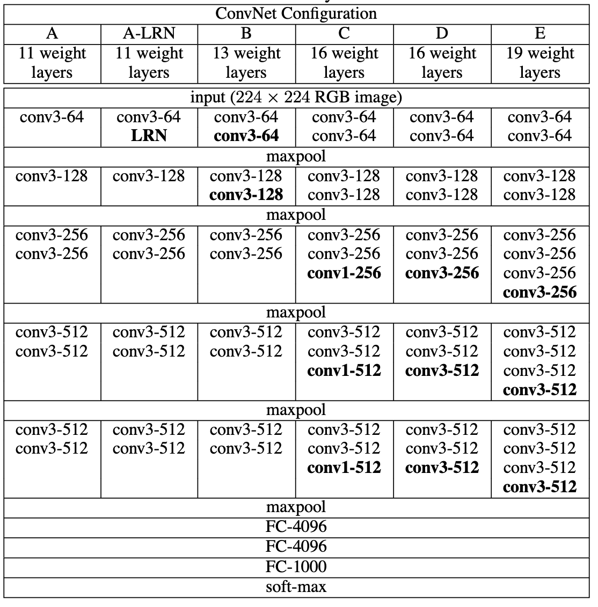

# Very Deep Convolutional Networks for Large-Scale Image Recognition

### 1. Introduction 

In recent years, Convolutional Networks enabled groundbreaking breakthroughs in large-scale computer vision tasks. Various models that exhibit state-of-the-art performance were introduced. This paper mainly focuses on how each ConvNet architecture’s depth affects overall performance.

### 2. ConvNet Configurations

**Architecture**

The input to the ConvNet is fixed to 224x224 RGB image, which has been preprocessed by subtracting the mean RGB values. This input is passed through multiple 3x3 filters, and occasionally 1x1 filters. Stride is set as 1 for the whole process, and padding is used such that the sizes are main- tained. Spatial padding is done by five max-pool over 2x2 window with stride 2. The last three layers are converted to Fully-Connected layers, with the first two with 4096 channels and the last with 1000 layers. Finally, all hidden layers are equipped with ReLU for non-linearity.

**Configurations**

Configurations are outlined in Table 1. It shows five different architectures, from A to E. They all share the same generic form except for their depths

**Discussion**

As mentioned earlier, all architectures use three 3x3 receptive fields instead of 7x7 size filters. There are two main following advantages.

**1. Allows the network to incorporate three non-linear rectification layers, which helps the decision function to be more discriminative**
**2. Decrease the number of parameters from 49*C^2 to 27*C^2 (C Channels)**

**Classification Framework Training**

Batch size was set to 256, momentum to 0.9, and weight decay of 5 ∗ 10^-4 (L2 penalty). Learning rate was initially 10− 2 , with decreasing factor 10. Pre-trained initial weights of A(Table 1), trained with random initialisation, was used throughout all other networks in the beginning and the last three FC layers.

Crop was done by two different methods, single-scale training and multi- scale training. Single-scale training uses a fixed S, which is the smallest side of an training image that were randomly cropped into 224x224. The sec- ond approach individually rescales the input image within the range [Smin, Smax], where Smin = 256 and Smax = 512. Multi-scale training enables the network to recognise objects over various sizes.

**Testing**
After training, the output FC layers are converted to one 7x7 conv.layer, and two 1x1 conv.layers. This convolutional net is then applied to the whole image. This result leads to a class score map and a variable spatial resolution.
